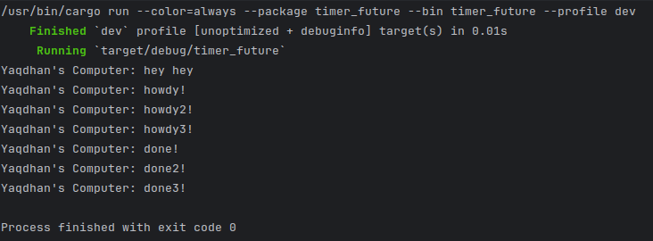
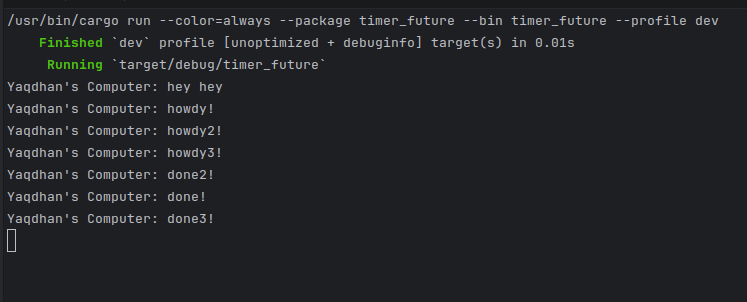

# Module 10: Asynchronous Programming (Timer)

## Experiment 1.2: Understanding How It Works

When we run the modified code, the text "Yaqdhan's Computer: hey hey" is printed to the console before "Yaqdhan's Computer: howdy!" and "Yaqdhan's Computer: done!". This happens because of how asynchronous programming and the executor work in Rust. The `spawner.spawn(...)` function does not immediately execute the future; it merely constructs the future and pushes it onto the task queue. The main thread continues running synchronously, which is why it immediately hits and executes the `println!("Yaqdhan's Computer: hey hey");` line. The future inside the `spawn` block is only actually executed when we call `executor.run()` at the very end of the `main` function. `executor.run()` blocks the main thread, pulls tasks from the queue, and polls them to completion.

## Experiment 1.3: Multiple Spawn and Removing Drop

**With `drop(spawner)`**

**Without `drop(spawner)`**

**What is the effect of spawning?** Spawning allows us to submit multiple concurrent tasks to the executor's queue. They can make progress concurrently whenever they yield (like waiting for a timer), rather than blocking the whole thread.

**What is the spawner for?** The spawner is essentially the transmitting end (Sender) of an MPSC (Multi-Producer, Single-Consumer) channel. Its job is to take a future, wrap it in a task, and send it through the channel to the queue.

**What is the executor for?** The executor is the receiving end (Receiver) of the channel. It continuously polls tasks from the queue, executes them until they block (`.await`), and parks them until they are ready to be polled again.

**What is the drop for?** The `drop(spawner)` function explicitly destroys the sending end of the channel. This signals to the channel that no more tasks will ever be sent.

**What happens when removing `drop(spawner)`?** When we remove `drop(spawner)`, the executor's `run()` loop never terminates. Even after all tasks are completed, the executor continues to wait for new messages from the channel because the channel is never formally closed. Consequently, the program hangs indefinitely instead of exiting gracefully.
