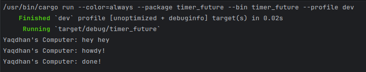

# Module 10: Asynchronous Programming (Timer)

## Experiment 1.2: Understanding How It Works

When we run the modified code, the text "Yaqdhan's Computer: hey hey" is printed to the console before "Yaqdhan's Computer: howdy!" and "Yaqdhan's Computer: done!". This happens because of how asynchronous programming and the executor work in Rust. The `spawner.spawn(...)` function does not immediately execute the future; it merely constructs the future and pushes it onto the task queue. The main thread continues running synchronously, which is why it immediately hits and executes the `println!("Yaqdhan's Computer: hey hey");` line. The future inside the `spawn` block is only actually executed when we call `executor.run()` at the very end of the `main` function. `executor.run()` blocks the main thread, pulls tasks from the queue, and polls them to completion.
